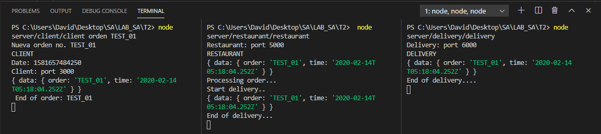

# TAREA 2 - COREOGRAFIA Y ORQUESTACION DE SERVICIOS

##### Esteban David Alvarez Bor - 201313872

## Configuracion inicial
Para poder ejecutar correctamente la aplicacion es necesario contar con **NodeJS** en su version __10.16.2__ o superior, 
asi mismo contar con **NPM** para poder obtener los modulos necesarios para su correcto funcionamiento. Ejecutar comando: 

```
npm install
```  

## SERVICIOS

### **ClIENTE**
Para enviar la orden se debera iniciar el servicio agregando el comando **orden** seguido de un numero de orden adicional, este numero se enviara al servicio de restaurante para poder ser procesado

```
node server/cliente/cliente orden NO_ORDER
```
Al finalizar la entrega, la orden sera enviada por el restaurante al cliente como parte de la confirmacion de entrega a la ruta __/client__ la cual se encargara de concluir el proceso.

```
app.post('/client', (req, res) => {
    let body = req.body;
    /*
    * CODIGO
    */
    res.status(200).json({
        message: 'End of transaction'
    });
});
```

### **RESTAURANTE**
```
node server/restaurant/restaurant
```

El servicio de restaurante, obtendra las ordenes de los clientes, las procesara y luego solicitara al servicio de entregas el siguiente paso en el proceso de la orden.

```
app.post('/restaurant', (req, res) => {
    /*
    * CODIGO
    */
    axios.post(`http://localhost:${port.DELIVERY_PORT}/delivery`, {
        data: body.data
    });
    /*
    * CODIGO
    */
});
```

El servicio de restaurante tambien se encarga de confirmar la entrga del repartidor y el cliente, notificando al ultimo que se concluyo el procesamiento de la orden satisfactoriamente

```
app.post('/restaurant-c', (req, res) => {
    /*
    * CODIGO
    */
    axios.post(`http://localhost:${port.CLIENT_PORT}/client`, {
        data: body.data
    });
    /*
    * CODIGO
    */
    
});
```

### **ENTREGA**
```
node server/delivery/delivery
```
El servicio de entrega **(DELIVERY)** se encarga de obtener la orden del restaurante y realizar el proceso de entrega al cliente, al concluir este proceso de entrega, notificara al servicio de RESTAURANTE que la entrga se realizo de manera exitosa para que el restaurante continue con el proceso final de la orden.

```
app.post('/delivery', (req, res) => {
    /*
    * CODIGO
    */
    axios.post(`http://localhost:${port.RESTAURANT_PORT}/restaurant-c`, {
        data: body.data
    });
    /*
    * CODIGO
    */
});
```

### **DEMOSTRACION**
Para demostrar el correcto funcionamiento de los servicios se desarrollo un video demostrativo el cual ejemplifica:
1. Creacion de una order por el cliente.
2. Procesamiento de la orden por el servicio de restaurante.
3. Procesamiento de la orden por el servicio de repartidor.
4. Confirmacion de la orden en el servicio de restaurante por el repartidor.
5. Confirmacion de la orden al cliente por el restaurante.

[Video demostrativo](https://youtu.be/08tBza3kols)


